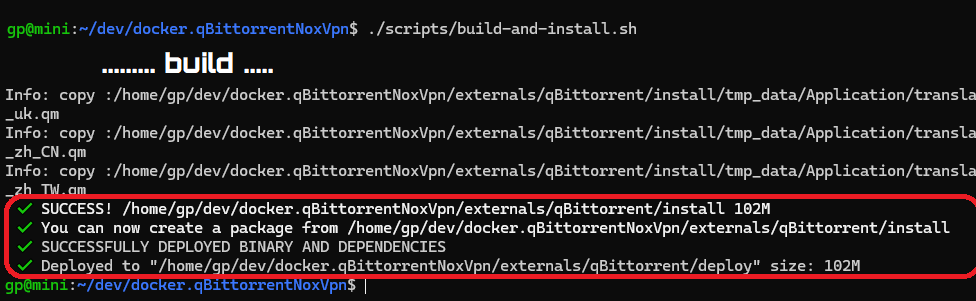
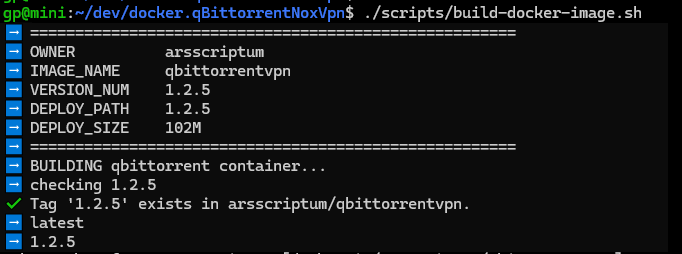
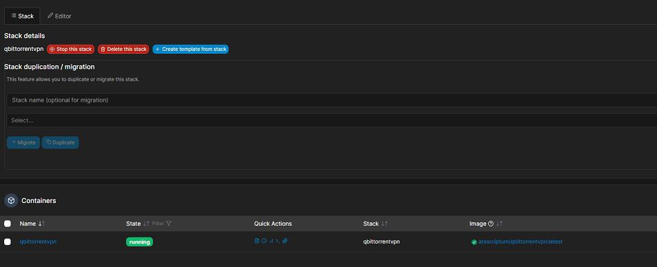

<center></center>

# qBittorrent with WebUI and OpenVPN

Docker container which runs the latest headless qBittorrent client with WebUI while connecting to OpenVPN with iptables killswitch to prevent IP leakage when the tunnel goes down.


## Build Docker Container

1. Build and install 

```bash
./scripts/build-and-install.sh
```



2. Build the container

```bash
./scripts/build-docker-image.sh
```




## Docker Features

* Base: Ubuntu 20.04
* Always builds latest qBittorrent client
* Size: 300MB
* Selectively enable or disable OpenVPN support
* IP tables kill switch to prevent IP leaking when VPN connection fails
* Specify name servers to add to container
* Configure UID, GID, and UMASK for config files and downloads by qBittorrent

### Run container from Docker registry

The container is available from the [DockerHub](https://hub.docker.com/repository/docker/arsscriptum/qbittorrentvpn/general) registry and this is the simplest way to get it.


## Docker-Compose - Portainer

Personally, I use Portainer and Docker-Compose. I have a [docker-compose.yml](docker-compose.yml) file




### Instructions- Example

To Run qbittorrent in a vpn, in a docker container using docker-compose, the road is not too bumpy. But you need to know your way around the place.

Even tough I provided a [docker-compose.yml](./docker-compose-config/docker-compose.yml) exmple file, try to create the basic configuration using [this script](./docker-compose-config/create-compose-config.sh).

#### create-compose-config.sh

This will create the structure for youto run qBittorrenVPN

```bash
/docker-compose-config/run_config.sh /tmp/your_qbittorrent_home
``` 


## Variables, Volumes, and Ports

### Environment Variables

| Variable | Required | Function | Example |
|----------|----------|----------|----------|
|`VPN_ENABLED`| Yes | Enable VPN? (yes/no) Default:yes|`VPN_ENABLED=yes`|
|`VPN_USERNAME`| No | If username and password provided, configures ovpn file automatically |`VPN_USERNAME=ad8f64c02a2de`|
|`VPN_PASSWORD`| No | If username and password provided, configures ovpn file automatically |`VPN_PASSWORD=ac98df79ed7fb`|
|`LAN_NETWORK`| Yes | Local Network with CIDR notation |`LAN_NETWORK=192.168.1.0/24`|
|`NAME_SERVERS`| No | Comma delimited name servers |`NAME_SERVERS=8.8.8.8,8.8.4.4`|
|`PUID`| No | UID applied to config files and downloads |`PUID=99`|
|`PGID`| No | GID applied to config files and downloads |`PGID=100`|
|`UMASK`| No | GID applied to config files and downloads |`UMASK=002`|
|`WEBUI_PORT_ENV`| No | Applies WebUI port to qBittorrents config at boot (Must change exposed ports to match)  |`WEBUI_PORT_ENV=8080`|
|`INCOMING_PORT_ENV`| No | Applies Incoming port to qBittorrents config at boot (Must change exposed ports to match) |`INCOMING_PORT_ENV=8999`|


### Volumes

| Volume | Required | Function | Example |
|----------|----------|----------|----------|
| `config` | Yes | qBittorrent and OpenVPN config files | `/your/config/path/:/config`|
| `downloads` | No | Default download path for torrents | `/your/downloads/path/:/downloads`|

### Ports
| Port | Proto | Required | Function | Example |
|----------|----------|----------|----------|----------|
| `8080` | TCP | Yes | qBittorrent WebUI | `8080:8080`|
| `8999` | TCP | Yes | qBittorrent listening port | `8999:8999`|
| `8999` | UDP | Yes | qBittorrent listening port | `8999:8999/udp`|

### Access the WebUI
Access http://IPADDRESS:PORT from a browser on the same network.

### Default Credentials

| Credential | Default Value |
|----------|----------|
|`WebUI Username`| admin |
|`WebUI Password`| adminadmin |


# How to use OpenVPN
The container will fail to boot if `VPN_ENABLED` is set to yes or empty and a .ovpn is not present in the /config/openvpn directory. Drop a .ovpn file from your VPN provider into /config/openvpn and start the container again. You may need to edit the ovpn configuration file to load your VPN credentials from a file by setting `auth-user-pass`.

**Note:** The script will use the first ovpn file it finds in the /config/openvpn directory. Adding multiple ovpn files will not start multiple VPN connections.

## Example auth-user-pass option
`auth-user-pass credentials.conf`

## Example credentials.conf
```
username
password
```

## PUID/PGID
User ID (PUID) and Group ID (PGID) can be found by issuing the following command for the user you want to run the container as:

```
id <username>
```


## Torrenting

Please read [this](doc/torrenting.md)

.
